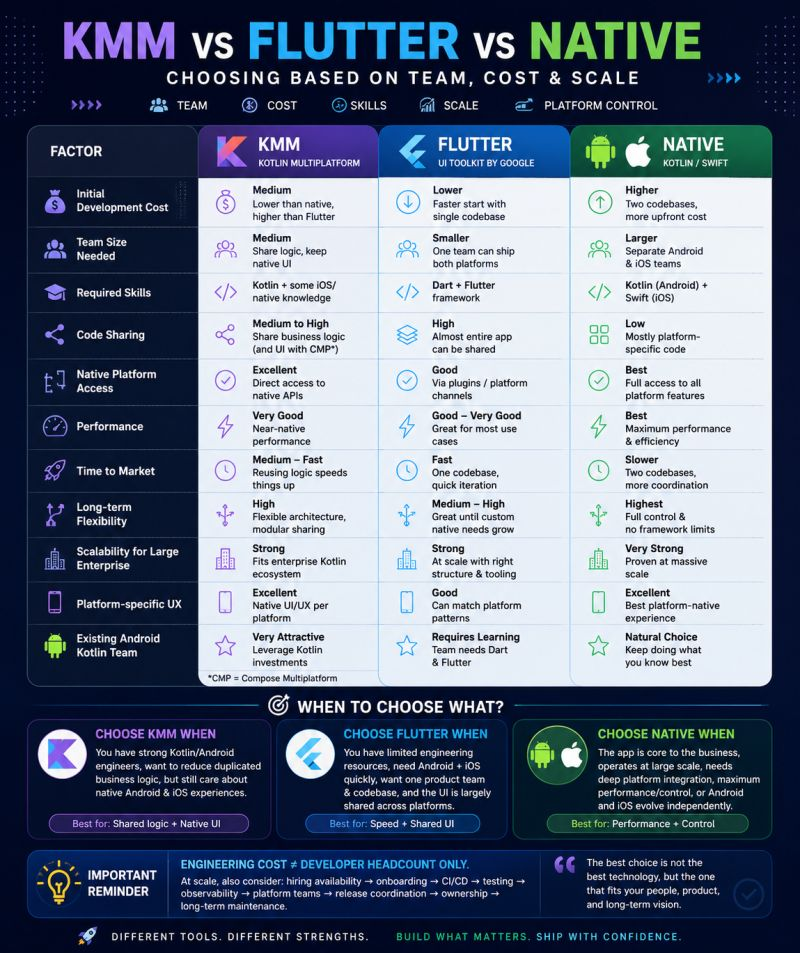

# Panduan Praktikum: Instalasi Flutter & Dart

> Latest update 2026

---

## 1. Mengenal Metode Pengembangan Aplikasi Mobile

Sebelum masuk ke instalasi, mahasiswa perlu memahami dulu **posisi Flutter** di antara pendekatan pengembangan mobile yang ada saat ini.

### 1.1 Native Development

Aplikasi dibangun langsung menggunakan bahasa dan SDK resmi platform:

- **Android** → Kotlin / Java + Android SDK
- **iOS** → Swift / Objective-C + Xcode & iOS SDK

**Kelebihan:**

- Performa maksimal karena berjalan langsung di atas API platform tanpa layer tambahan.
- Akses penuh dan tercepat ke fitur/hardware terbaru (kamera, sensor, AR, background service, dsb).
- Look & feel paling sesuai dengan konvensi platform (Material/Cupertino "asli").

**Kekurangan:**

- Kode tidak bisa dipakai lintas platform → harus menulis 2 basis kode terpisah (Android & iOS).
- Butuh 2 tim/skill set berbeda → biaya development dan maintenance lebih tinggi.
- Waktu rilis fitur baru ke kedua platform cenderung tidak bersamaan.

**Kapan dipakai:** aplikasi yang sangat bergantung pada performa tinggi (game berat, aplikasi kamera/AR, editing video), aplikasi yang butuh akses API OS paling baru lebih dulu, atau saat resource tim & budget memang mendukung dua basis kode.

### 1.2 Hybrid / Cross-Platform Development

Satu basis kode dipakai untuk banyak platform. Ada dua pendekatan besar:

**a. WebView-based Hybrid** (mis. Ionic, Cordova)
Aplikasi pada dasarnya adalah web app (HTML/CSS/JS) yang dibungkus dalam WebView native.

- ✅ Sangat cepat untuk prototipe, tim web bisa langsung terjun.
- ❌ Performa paling lambat di antara semua pendekatan karena rendering lewat WebView.

**b. Compiled/Native-rendered Cross-Platform** (mis. Flutter, React Native, Kotlin Multiplatform)
Kode ditulis sekali, tapi dikompilasi/dirender menjadi komponen yang lebih dekat ke native, bukan sekadar web di dalam WebView.

- ✅ Satu basis kode untuk Android, iOS, bahkan web/desktop.
- ✅ Waktu development lebih singkat, biaya maintenance lebih rendah.
- ❌ Untuk kasus ekstrem (grafis 3D berat, integrasi hardware sangat spesifik), tetap ada celah performa/akses dibanding native murni, meski gapnya kian menyempit.

### 1.3 Perbandingan Singkat

| Aspek                      | Native                                   | Hybrid (Flutter/RN)                                   | Hybrid WebView                    |
| -------------------------- | ---------------------------------------- | ----------------------------------------------------- | --------------------------------- |
| Performa                   | Terbaik                                  | Sangat baik, mendekati native                         | Paling rendah                     |
| Basis kode                 | Terpisah per platform                    | Satu untuk semua platform                             | Satu untuk semua platform         |
| Kecepatan development      | Lambat (2x kerja)                        | Cepat                                                 | Sangat cepat                      |
| Akses fitur native terbaru | Instan                                   | Umumnya cepat menyusul (via plugin)                   | Terbatas/butuh plugin tambahan    |
| Biaya maintenance          | Tinggi                                   | Rendah–sedang                                         | Rendah                            |
| Cocok untuk                | Game berat, AR/VR, aplikasi sistem-level | Mayoritas aplikasi bisnis, e-commerce, produk startup | MVP super cepat, konten sederhana |

### 1.4 Kapan Pakai Kotlin Multiplatform (KMP) vs Flutter/Dart?

Ini pertanyaan yang sering muncul di industri 2025–2026 karena keduanya sama-sama solusi cross-platform dari "kubu" berbeda (Google untuk Flutter, JetBrains/Google untuk KMP).

**Kotlin Multiplatform (KMP):**

- Filosofinya **"share logic, native UI"** — yang dibagi biasanya hanya business logic, networking, database (lewat KMP + Compose Multiplatform bila mau share UI juga).
- UI tetap bisa ditulis native (SwiftUI di iOS, Jetpack Compose di Android) sehingga tampilan & feel benar-benar native 100%.
- Cocok jika **tim sudah punya aplikasi native existing** dan hanya ingin berbagi logic (mis. validasi, model data, use case) tanpa menulis ulang UI.
- Cocok untuk perusahaan dengan tim Android/iOS terpisah yang ingin **migrasi bertahap**, bukan rewrite total.
- Ekosistem plugin/package belum sebesar Flutter, komunitas lebih kecil.

**Flutter/Dart:**

- Filosofinya **"share everything"** — UI, logic, dan navigasi semua dalam satu basis kode, dirender oleh Skia/Impeller sendiri (bukan widget native OS).
- Cocok untuk **produk baru dari nol (greenfield project)**, startup, MVP, atau tim kecil yang ingin satu tim mengerjakan Android + iOS + Web + Desktop sekaligus.
- Ekosistem package (pub.dev) sangat besar, dokumentasi lengkap, hot reload memudahkan iterasi cepat — sangat relevan untuk kebutuhan **praktikum/pembelajaran**.
- Kurang ideal jika harus 100% menyatu dengan codebase native lama yang sudah besar dan kompleks.

**Ringkasnya:**

- Mulai proyek baru, tim kecil, ingin cepat rilis ke banyak platform → **Flutter**.
- Sudah punya aplikasi native, ingin berbagi logic saja tanpa mengubah UI native → **Kotlin Multiplatform**.

---



---

## 2. Catatan Tambahan

| Poin awal                                                                                  | Tambahan                                                                                                                                                       |
| ------------------------------------------------------------------------------------------ | -------------------------------------------------------------------------------------------------------------------------------------------------------------- |
| Download Open JDK 13 manual + set `JAVA_HOME` manual                                       | Sejak Flutter versi modern, **Android Studio sudah membundel JDK (JBR)** sendiri. Set manual JDK hanya perlu jika **tidak** pakai Android Studio sama sekali.  |
| `sdkmanager`, `avdmanager` command line manual                                             | Masih valid untuk instalasi **tanpa Android Studio**, tapi bagi pemula jauh lebih mudah lewat **Android Studio SDK Manager & Device Manager (GUI)**.           |
| belum ada penjelasan manajemen versi Flutter                                               | Ditambahkan sekilas tentang **FVM** (Flutter Version Management) sebagai best practice tim/industri saat mengelola banyak proyek dengan versi Flutter berbeda. |
| Struktur langkah agak panjang & bercampur (JDK, Android SDK, VS Code jadi satu alur besar) | Dipecah menjadi tahapan modular yang jelas: **Prasyarat → Jalur A (tanpa Android Studio) → Jalur B (dengan Android Studio) → Verifikasi.**                     |

---

## 3. Prasyarat Umum (Berlaku untuk Jalur A & B)

Sebelum memulai instalasi, pastikan sudah tersedia:

1. **Sistem Operasi**: Windows 10/11 64-bit (atau macOS/Linux — panduan ini fokus Windows, mengikuti modul asli).
2. **Ruang disk kosong**: minimal 2.5 GB khusus untuk Flutter SDK, disarankan total free space 10 GB+ jika juga menginstal Android Studio & emulator.
3. **Git for Windows** — wajib, karena Flutter tool menggunakan Git di baliknya.
   👉 Download: https://git-scm.com/download/win
4. Koneksi internet stabil (proses download SDK & dependency cukup besar, >1 GB).

---

## 4. Jalur A — Instalasi Flutter **Tanpa** Android Studio

Cocok untuk mahasiswa yang ingin ringan (hemat resource laptop) dan hanya memakai VS Code sebagai editor.

### Langkah 1 — Unduh Flutter SDK

1. Buka https://docs.flutter.dev/install/manual (URL resmi terbaru; URL lama `flutter.dev/docs/get-started/install` otomatis diarahkan ke sini).
2. Pilih **Windows**, download SDK versi **stable** terbaru (format `.zip`).

### Langkah 2 — Ekstrak ke Lokasi Permanen

- Ekstrak ke folder **tanpa spasi** dan **bukan** di `C:\Program Files\` (butuh privilege admin).
- Contoh: `C:\src\flutter` atau `C:\Users\<nama>\dev\flutter`.

### Langkah 3 — Tambahkan Flutter ke PATH

1. Tekan `Win`, ketik `env`, pilih **Edit environment variables for your account**.
2. Pada **User variables**, pilih `Path` → **Edit** → **New**.
3. Masukkan path lengkap ke folder `bin`, contoh: `C:\src\flutter\bin`.
4. Klik **OK** di semua jendela, lalu **tutup dan buka ulang** Command Prompt/PowerShell (wajib, agar PATH baru terbaca).

### Langkah 4 — Verifikasi Awal

```
flutter doctor
```

Pada tahap ini biasanya masih muncul tanda `[!]` atau `[✗]` pada bagian Android toolchain — itu normal karena Android SDK belum terpasang.

### Langkah 5 — Pasang JDK & Android SDK (tanpa Android Studio)

Untuk Jalur A, JDK harus dipasang manual (berbeda dengan Jalur B yang sudah otomatis dapat JDK bawaan Android Studio). Tersedia **dua opsi sumber JDK** — pilih salah satu, langkah setelah unduh **sama persis** karena keduanya sama-sama build dari source code OpenJDK.

> ℹ️ **Kenapa hasilnya sama?** "OpenJDK" adalah proyek open-source resminya, sedangkan Eclipse Temurin adalah _distribusi/build_ dari source code OpenJDK yang sama, hanya dikemas dan didukung secara jangka panjang (LTS) oleh Eclipse Adoptium. Isi folder (`bin`, `lib`, dst.) strukturnya identik, sehingga cara set `JAVA_HOME` dan PATH juga identik.

**Opsi 1 — Eclipse Temurin JDK 17 (disarankan, installer lebih praktis)**

1. Unduh installer `.msi` dari https://adoptium.net/ (pilih versi 17 LTS, Windows x64).
2. Jalankan installer. Pada opsi instalasi, centang **"Set JAVA_HOME variable"** dan **"Add to PATH"** — Temurin bisa mengurus ini otomatis lewat installer, sehingga langkah environment variable manual bisa dilewati.

**Opsi 2 — OpenJDK murni (dari jdk.java.net / build vendor lain)**

1. Unduh arsip `.zip` JDK 17 dari sumber OpenJDK, contoh https://jdk.java.net/17/ (community build) — perhatikan versi ini biasanya build jangka pendek, jadi cocok untuk latihan tapi kurang ideal untuk penggunaan jangka panjang.
2. Ekstrak ke folder tanpa spasi, contoh `C:\src\jdk-17`.
3. Set environment variable secara manual (tidak otomatis seperti installer Temurin):
   - Buat **User variable** baru: `JAVA_HOME` → `C:\src\jdk-17`
   - Tambahkan ke **PATH**: `%JAVA_HOME%\bin`

**Verifikasi (berlaku untuk Opsi 1 maupun Opsi 2):**

```
java -version
```

Pastikan versi yang muncul adalah `17.x.x`, tandanya JDK sudah terpasang dan terbaca dengan benar — tanpa peduli dari opsi mana asalnya.

---

Setelah JDK siap, lanjutkan ke **Android SDK**:

1. **Android SDK Command-line Tools**: unduh dari https://developer.android.com/studio#command-tools (di bagian bawah halaman, tanpa perlu download Android Studio penuh).
2. Ekstrak ke, misalnya, `C:\src\androidSDK\cmdline-tools\latest`.
3. Tambahkan environment variable:
   - `ANDROID_HOME` → `C:\src\androidSDK`
   - Tambahkan ke PATH: `C:\src\androidSDK\cmdline-tools\latest\bin` dan `C:\src\androidSDK\platform-tools`
4. Buka CMD baru, jalankan:
   ```
   sdkmanager "platform-tools" "platforms;android-34" "build-tools;34.0.0"
   flutter doctor --android-licenses
   ```
   Tekan `y` untuk menyetujui semua lisensi hingga muncul **"All SDK package licenses accepted."**

### Langkah 6 — Verifikasi Akhir

```
flutter doctor
```

Pastikan minimal baris **Flutter** dan **Android toolchain** bertanda centang `[✓]`.

### Langkah 7 — Setup VS Code sebagai Editor

1. Unduh VS Code: https://code.visualstudio.com/download
2. Buka VS Code → tab **Extensions** (`Ctrl+Shift+X`) → cari **"Flutter"** → **Install** (extension **Dart** akan otomatis ikut terpasang).

---

## 5. Jalur B — Instalasi Flutter **Dengan** Android Studio

Cocok untuk mahasiswa pemula karena Android SDK, JDK, emulator, dan lisensi bisa diatur lewat **GUI**, tanpa banyak command line.

### Langkah 1 — Unduh & Instal Android Studio

1. Unduh dari https://developer.android.com/studio
2. Ikuti wizard instalasi standar (Next → Next → Finish). Android Studio modern **sudah termasuk JDK bawaan (JetBrains Runtime)**, sehingga langkah instal JDK terpisah **tidak diperlukan lagi**.

### Langkah 2 — Unduh Flutter SDK & Ekstrak

Sama seperti Jalur A Langkah 1–2: unduh dari https://docs.flutter.dev/install/manual, ekstrak ke folder tanpa spasi, contoh `C:\src\flutter`.

### Langkah 3 — Pasang Plugin Flutter di Android Studio

1. Buka Android Studio → **More Actions / Configure → Plugins** (pada versi lama menunya persis seperti modul: _Configure → Plugins_).
2. Tab **Marketplace** → cari **"Flutter"** → **Install** (plugin **Dart** otomatis ikut terpasang).
3. Klik **Restart IDE** saat diminta.

### Langkah 4 — Setup Android SDK lewat GUI

1. Setelah restart, buka **More Actions → SDK Manager** (atau `Tools → SDK Manager` di dalam project).
2. Di tab **SDK Platforms**, centang Android API level terbaru yang stabil (mis. Android 14 / API 34).
3. Di tab **SDK Tools**, pastikan **Android SDK Build-Tools**, **Android SDK Platform-Tools**, dan **Android Emulator** tercentang.
4. Klik **Apply** untuk mendownload komponen yang dipilih.

### Langkah 5 — Buat Proyek Flutter Percobaan

1. Dari halaman awal Android Studio, pilih **New Flutter Project**.
2. Jika diminta **Flutter SDK path**, arahkan ke folder ekstrak Flutter (contoh `C:\src\flutter`).
3. Isi **Project name** (huruf kecil, tanpa spasi, contoh `flutter_app`), tentukan lokasi project, lalu **Finish**.
4. Tunggu proses _Pub get_ / indexing selesai.

### Langkah 6 — Setujui Lisensi Android & Cek dengan Flutter Doctor

1. Buka **Terminal** di dalam Android Studio.
2. Jalankan:
   ```
   flutter doctor --android-licenses
   ```
   Tekan `y` untuk semua sampai muncul **"All SDK package licenses accepted."**
3. Jalankan `flutter doctor` sekali lagi dan pastikan tidak ada tanda `[✗]` yang kritikal.

### Langkah 7 — Siapkan Perangkat untuk Menjalankan Aplikasi

Pilih salah satu:

- **Emulator Android**: buka **Device Manager** di Android Studio → **Create Device** → pilih model (mis. Pixel 6) → pilih system image → **Finish**.
- **Perangkat fisik**: aktifkan **Developer Options** dan **USB Debugging** di HP Android, lalu sambungkan via USB.

> 📌 Catatan: langkah manual `avdmanager create avd` di modul lama tetap berfungsi, tapi bagi pemula jauh lebih aman lewat **Device Manager (GUI)** karena mengurangi risiko salah ketik argumen command line.

### Langkah 8 — Jalankan Aplikasi

1. Pastikan emulator/perangkat fisik sudah terdeteksi (muncul di dropdown device Android Studio).
2. Tekan tombol **Run** (▶) atau `Shift+F10`.
3. Tunggu proses build Gradle pertama kali (bisa 3–10 menit tergantung koneksi & spesifikasi laptop) hingga muncul aplikasi contoh **"Flutter Demo Home Page"** dengan counter di layar emulator/HP.

---

## 6. Verifikasi Akhir & Troubleshooting Umum

Jalankan perintah berikut sebagai langkah verifikasi wajib di akhir praktikum:

```
flutter doctor -v
```

| Gejala                                                               | Penyebab Umum                                          | Solusi                                                                               |
| -------------------------------------------------------------------- | ------------------------------------------------------ | ------------------------------------------------------------------------------------ |
| `flutter` tidak dikenali di CMD                                      | PATH belum benar / CMD belum direstart                 | Cek ulang langkah PATH, buka CMD baru                                                |
| `Some Android licenses not accepted`                                 | Lisensi SDK belum disetujui                            | `flutter doctor --android-licenses`, input `y`                                       |
| `No devices available`                                               | Emulator belum dibuat / HP belum terhubung             | Buat AVD baru via Device Manager, atau cek USB debugging                             |
| `repositories.cfg could not be loaded` (saat pakai `sdkmanager` CLI) | File konfigurasi belum ada                             | Buat folder & file kosong `repositories.cfg` sesuai path yang diminta di pesan error |
| Build Gradle sangat lama di percobaan pertama                        | Wajar — Gradle mengunduh dependency besar pertama kali | Tunggu, pastikan koneksi stabil; percobaan berikutnya jauh lebih cepat (cache)       |

---

## 7. (Opsional) Manajemen Versi Flutter dengan FVM

Di lingkungan kerja profesional, satu laptop sering menangani beberapa proyek dengan versi Flutter berbeda. Tool **FVM (Flutter Version Management)** membantu:

```
dart pub global activate fvm
fvm install stable
fvm use stable
```

Dengan FVM, setiap proyek bisa mengunci versi Flutter-nya sendiri lewat file `.fvmrc`, sehingga tidak ada konflik "punya saya jalan, punya teman error" akibat beda versi SDK. Ini **tidak wajib** untuk praktikum dasar, tetapi baik diketahui mahasiswa sebagai gambaran praktik industri.

---
