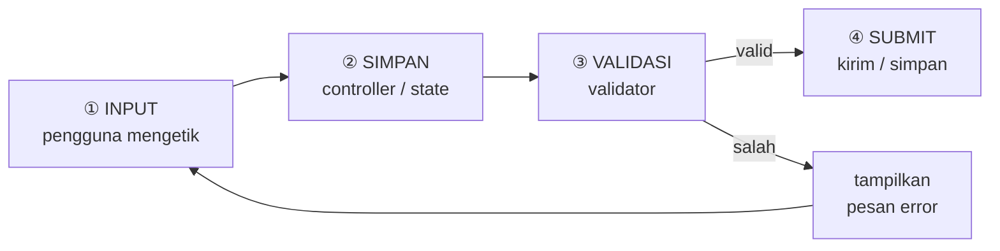
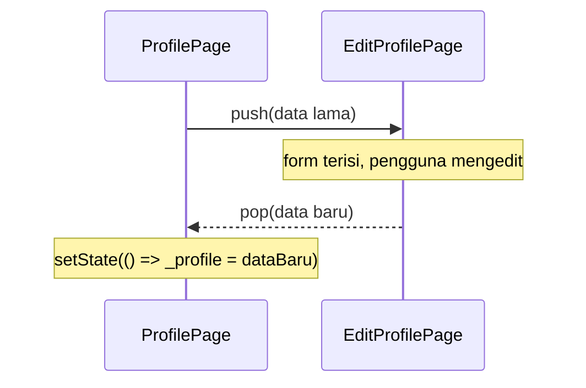

# Modul 6 — Form, Input & Validasi

Praktikum Mobile Programming dengan **Flutter & Dart**

Studi kasus: **Kartu Profil Digital**

<div class="mt-8 text-sm opacity-70">2 pertemuan × 4 jam</div>

<div class="mt-2 text-sm">
<a href="https://github.com/iffakhry/mobile-app-jti/blob/main/8-form-input-validasi.md" target="_blank">📖 Buka modul lengkap ↗</a>
</div>

<!--
Slide ini mengikuti file modul-06-form-input-validasi.md.
Tautan "📖" di tiap slide mengarah ke bagian kode lengkapnya.
-->

---

# 🎯 Apa yang Akan Kamu Buat?

Fitur **Edit Profil** pada Kartu Profil Digital: form yang bisa diisi, divalidasi, dan hasilnya langsung tampil di kartu.

```text
┌─────────────────────┐          ┌─────────────────────┐
│ Kartu Profil Digital│          │ ← Edit Profil       │
│                     │          │                     │
│       ( 🙂 )        │          │ [👤 Nama Lengkap  ] │
│   Fakhry Firdaus    │  tekan   │ [✉️  Email         ] │
│ Mahasiswa Flutter   │ ───────► │ [📞 No. HP        ] │
│                     │  "Edit"  │ [📝 Bio           ] │
│ ✉️ fakhry@email.com  │          │                     │
│ 📞 081234567890      │ ◄─────── │ [ Simpan Perubahan ]│
│          [✏️ Edit]   │  "Simpan"└─────────────────────┘
└─────────────────────┘  data berubah
```

---

# 🧭 Tujuan Pembelajaran

Setelah modul ini, kamu mampu:

<v-clicks>

1. Membuat input dengan `TextField` + `TextEditingController`
2. Memakai berbagai **Button** dan memahami `setState()`
3. Membangun form dengan `Form` + `TextFormField`
4. Menulis aturan **validasi** (wajib, panjang, email, nomor HP)
5. Menerapkan **praktik industri**: widget reusable, validator terpisah, fokus keyboard, loading state, kirim data antarhalaman

</v-clicks>

---

# ⏱️ Peta Waktu

<div class="grid grid-cols-2 gap-8 compact">
<div>

### Pertemuan 1 (240 mnt)

| Menit | Bagian |
|---|---|
| 20 | 0 · Persiapan project |
| 15 | 1 · Peta konsep |
| 50 | 2 · `TextField` |
| 45 | 3 · Button & `setState()` |
| 15 | ☕ Istirahat |
| 60 | 4 · `Form` & `TextFormField` |
| 35 | Challenge 1 |

</div>
<div>

### Pertemuan 2 (240 mnt)

| Menit | Bagian |
|---|---|
| 55 | 5 · Validasi input |
| 55 | 6 · UX standar industri |
| 15 | ☕ Istirahat |
| 40 | 7 · Kirim data ke profil |
| 20 | 8 · Finalisasi & uji |
| 55 | Challenge akhir |

</div>
</div>

<style>
.compact table { font-size: 0.8em; }
.compact td, .compact th { padding-top: 0.2rem; padding-bottom: 0.2rem; }
.compact h3 { margin-top: 0.4rem; margin-bottom: 0.4rem; }
</style>

---

# 📦 Prasyarat & Tips

- Project **Kartu Profil Digital** dari modul sebelumnya (atau buat baru di Bagian 0)
- Flutter SDK, VS Code, emulator/Chrome siap
- Paham `StatelessWidget`, `StatefulWidget`, `Column`, `Row`, `Card`, `ListView`

<div class="mt-6 p-4 rounded bg-yellow-100 text-yellow-900">

💡 **Hot Reload** (`r`) untuk perubahan tampilan.
**Hot Restart** (`R`) setiap mengubah `initState()` atau menambah file baru.

</div>

---
layout: section
---

# Pertemuan 1

Fondasi Input

---

# Bagian 0 — Struktur Project

Rapikan project seperti aplikasi sungguhan:

```text
lib/
├── main.dart
├── models/
│   └── profile_data.dart
├── pages/
│   ├── profile_page.dart
│   └── edit_profile_page.dart     ← Bagian 2
├── utils/
│   └── validators.dart            ← Bagian 5
└── widgets/
    └── app_text_field.dart        ← Bagian 6
```

💡 Pisahkan **model, halaman, widget, utilitas** → mudah dicari, dites, dan dipakai ulang.

<div class="mt-3 text-sm">
<a href="https://github.com/iffakhry/mobile-app-jti/blob/main/8-form-input-validasi.md#bagian-0--persiapan-project-20-menit" target="_blank">📖 Langkah persiapan lengkap ↗</a>
</div>

---

# Bagian 0 — Model Data Profil

```dart
class ProfileData {
  const ProfileData({
    required this.name, required this.email,
    required this.phone, required this.bio,
  });

  final String name, email, phone, bio;   // semua final

  ProfileData copyWith({String? name, String? email,
      String? phone, String? bio}) {
    return ProfileData(
      name: name ?? this.name,
      // ... field lain dengan pola yang sama
    );
  }
}
```

📝 **Immutable model**: data baru dibuat lewat `copyWith`, bukan diubah langsung.

<div class="mt-3 text-sm">
<a href="https://github.com/iffakhry/mobile-app-jti/blob/main/8-form-input-validasi.md#langkah-02--model-data-profil" target="_blank">📖 Kode lengkap model ↗</a>
</div>

---

# Bagian 0 — Halaman Profil (Kode Awal)

Data profil disimpan di **variabel state** `_profile` (bukan `final`).

```dart
class _ProfilePageState extends State<ProfilePage> {
  ProfileData _profile = const ProfileData(
    name: 'Fakhry Firdaus',
    email: 'fakhry@email.com',
    phone: '081234567890',
    bio: 'Mahasiswa yang sedang belajar Flutter',
  );
  // build(): Scaffold + ListView + CircleAvatar + Card/ListTile
}
```

<div class="mt-3 text-sm">
<a href="https://github.com/iffakhry/mobile-app-jti/blob/main/8-form-input-validasi.md#langkah-03--halaman-profil-kode-awal" target="_blank">📖 Kode lengkap ProfilePage ↗</a> ·
<a href="https://github.com/iffakhry/mobile-app-jti/blob/main/8-form-input-validasi.md#langkah-04--maindart" target="_blank">📖 main.dart ↗</a>
</div>

<div class="mt-6 p-3 rounded bg-green-100 text-green-900">

✅ **Checkpoint 0:** `flutter run` menampilkan kartu profil + tombol **Edit Profil** (belum berfungsi).

</div>

---

# Bagian 1 — Alur Kerja Sebuah Form

Seperti mengisi **formulir di loket**: isi → diperiksa petugas → diterima / dikembalikan dengan catatan.



---

# Bagian 1 — Siapa Mengerjakan Apa?

| Widget / Konsep | Perannya |
|---|---|
| `TextField` | Kotak input teks dasar |
| `TextEditingController` | Penampung isi teks (bisa dibaca & diubah) |
| `TextFormField` | `TextField` + **validasi** + terhubung ke `Form` |
| `Form` | "Petugas loket": memvalidasi banyak field sekaligus |
| `GlobalKey<FormState>` | "Remote control" untuk `Form` |
| Button | Pemicu aksi (mis. Simpan) |
| `setState()` | "Data berubah, gambar ulang!" |
| `validator` | Pemeriksa: `null` = valid, `String` = error |

---
layout: section
---

# Bagian 2

`TextField` & `TextEditingController`

<!-- ±50 menit -->

---

# 2.1 Anatomi `TextField`

```dart
TextField(
  controller: _nameController,           // penampung isi teks
  keyboardType: TextInputType.name,      // jenis keyboard
  textInputAction: TextInputAction.next, // tombol aksi keyboard
  decoration: const InputDecoration(     // tampilan kotak
    labelText: 'Nama Lengkap',
    hintText: 'Contoh: Fakhry Firdaus',
    prefixIcon: Icon(Icons.person_outline),
    border: OutlineInputBorder(),
  ),
  onChanged: (value) { /* tiap isi berubah */ },
)
```

<div class="mt-3 text-sm">
<a href="https://github.com/iffakhry/mobile-app-jti/blob/main/8-form-input-validasi.md#21-anatomi-textfield" target="_blank">📖 Penjelasan properti lengkap ↗</a>
</div>

---

# Properti Penting

<div class="grid grid-cols-2 gap-8 compact">
<div>

### `InputDecoration`

| Properti | Fungsi |
|---|---|
| `labelText` | Judul field |
| `hintText` | Contoh isian |
| `prefixIcon` / `suffixIcon` | Ikon kiri / kanan |
| `border` | Gaya garis kotak |
| `errorText` | Pesan error manual |

</div>
<div>

### `keyboardType`

| Nilai | Untuk |
|---|---|
| `text` | Teks umum |
| `emailAddress` | Email (ada `@`) |
| `phone` | Telepon |
| `number` | Angka |
| `multiline` | Teks panjang |

</div>
</div>

<style>
.compact table { font-size: 0.8em; }
.compact td, .compact th { padding-top: 0.2rem; padding-bottom: 0.2rem; }
.compact h3 { margin-top: 0.4rem; margin-bottom: 0.4rem; }
</style>

---

# 2.2 – 2.3 Membaca Input & `dispose()`

| Cara | Kapan dipakai |
|---|---|
| `onChanged: (value) {...}` | Bereaksi **setiap kali** mengetik (pencarian, counter) |
| `TextEditingController` | Baca/ubah isi **kapan saja** (saat tombol Simpan) |

<div class="mt-6 p-4 rounded bg-red-100 text-red-900">

⚠️ **Aturan emas:** setiap `TextEditingController` yang dibuat di `State` **wajib** dibuang di `dispose()` — kalau tidak, memori bocor (*memory leak*).

</div>

```dart
@override
void dispose() {
  _nameController.dispose();
  super.dispose();
}
```

<div class="mt-3 text-sm">
<a href="https://github.com/iffakhry/mobile-app-jti/blob/main/8-form-input-validasi.md#23-wajib-tahu-dispose" target="_blank">📖 Selengkapnya ↗</a>
</div>

---

# 2.4 Praktik — Halaman Edit Profil v1

Buat `lib/pages/edit_profile_page.dart` (`StatefulWidget`):

```dart
class _EditProfilePageState extends State<EditProfilePage> {
  final _nameController = TextEditingController();
  final _bioController = TextEditingController();

  @override
  void dispose() { /* dispose kedua controller */ }

  // build(): Scaffold → Padding → Column
  //   TextField(Nama, onChanged: debugPrint)
  //   TextField(Bio, maxLines: 3, onChanged: debugPrint)
}
```

<div class="mt-3 text-sm">
<a href="https://github.com/iffakhry/mobile-app-jti/blob/main/8-form-input-validasi.md#24-praktik-halaman-edit-profil-versi-1" target="_blank">📖 Kode lengkap Bagian 2.4 ↗</a>
</div>

---

# 2.5 Hubungkan Tombol "Edit Profil"

Di `profile_page.dart`:

```dart
floatingActionButton: FloatingActionButton.extended(
  onPressed: () {
    Navigator.push(
      context,
      MaterialPageRoute(builder: (_) => const EditProfilePage()),
    );
  },
  icon: const Icon(Icons.edit),
  label: const Text('Edit Profil'),
),
```

📝 `Navigator.push` membuka halaman baru di atas halaman sekarang; tombol *Back* otomatis melakukan `pop`. (Dibahas lengkap di modul berikutnya.)

<div class="mt-3 text-sm">
<a href="https://github.com/iffakhry/mobile-app-jti/blob/main/8-form-input-validasi.md#25-hubungkan-tombol-edit-profil" target="_blank">📖 Langkah lengkap ↗</a>
</div>

---

# ✅ Checkpoint 2 & ⚠️ Kesalahan Umum

<div class="p-3 rounded bg-green-100 text-green-900">

- Tombol **Edit Profil** membuka halaman baru
- Debug Console menampilkan `Nama: ...` & `Bio: ...` setiap huruf

</div>

| Gejala | Penyebab & solusi |
|---|---|
| `unbounded width` | `TextField` di `Row` tanpa `Expanded` |
| Warning controller | Lupa `dispose()` |
| Perubahan `initState` tak terlihat | Pakai **Hot Restart** |

---
layout: section
---

# Bagian 3

Button & `setState()`

<!-- ±45 menit -->

---

# 3.1 Jenis Tombol (Material 3)

<div class="grid grid-cols-2 gap-8 compact">
<div>

| Widget | Kapan |
|---|---|
| `FilledButton` | Aksi **utama** |
| `ElevatedButton` | Aksi penting + bayangan |
| `OutlinedButton` | Aksi **sekunder** |
| `TextButton` | Aksi ringan |
| `IconButton` | Aksi berupa ikon |

</div>
<div>

<div class="p-4 rounded bg-yellow-100 text-yellow-900">

💡 **Trik penting**

`onPressed: null` → tombol otomatis **nonaktif** (abu-abu, tidak bisa ditekan).

Inilah cara standar menonaktifkan tombol.

</div>

<div class="mt-3 text-sm">
<a href="https://github.com/iffakhry/mobile-app-jti/blob/main/8-form-input-validasi.md#31-jenis-tombol-di-material-3" target="_blank">📖 Selengkapnya ↗</a>
</div>

</div>
</div>

<style>
.compact table { font-size: 0.8em; }
.compact td, .compact th { padding-top: 0.2rem; padding-bottom: 0.2rem; }
.compact h3 { margin-top: 0.4rem; margin-bottom: 0.4rem; }
</style>

---

# 3.2 Memahami `setState()`

Flutter itu **deklaratif**: tampilan = hasil dari data. Data berubah → beri tahu Flutter.

```dart
setState(() {
  _preview = 'Halo!';   // ① ubah data di dalam sini
});                     // ② Flutter menjalankan build() ulang
```

| ✅ Lakukan | ❌ Hindari |
|---|---|
| Ubah variabel *di dalam* `setState` | `setState` di dalam `build()` (loop tak berujung) |
| Panggil hanya saat tampilan perlu berubah | `setState(() async {...})` |
| Kerjaan async di luar, lalu `setState` hasilnya | `setState` setelah halaman ditutup (cek `mounted`) |

<div class="mt-2 text-sm">
<a href="https://github.com/iffakhry/mobile-app-jti/blob/main/8-form-input-validasi.md#32-memahami-setstate" target="_blank">📖 Selengkapnya ↗</a>
</div>

---

# 3.3 Praktik — Preview, Counter, Tombol Dinamis

Tiga tambahan di `edit_profile_page.dart`:

```dart
String _preview = '';

void _showPreview() {
  setState(() => _preview = 'Halo, ${_nameController.text.trim()}! 👋');
}

// pada kedua TextField:
onChanged: (_) => setState(() {}),   // agar build() jalan ulang

// tombol: nonaktif saat nama kosong
FilledButton.icon(
  onPressed: _nameController.text.trim().isEmpty ? null : _showPreview,
  icon: const Icon(Icons.visibility_outlined),
  label: const Text('Tampilkan Preview'),
),
```

<div class="mt-3 text-sm">
<a href="https://github.com/iffakhry/mobile-app-jti/blob/main/8-form-input-validasi.md#33-praktik-preview-counter-dan-tombol-dinamis" target="_blank">📖 Kode lengkap + counter bio ↗</a>
</div>

<div class="mt-3 p-3 rounded bg-green-100 text-green-900">

✅ Tombol abu-abu saat nama kosong · klik → kartu `Halo, <nama>!` · counter bio bertambah

</div>

---
layout: center
class: text-center
---

# ☕ Istirahat 15 Menit

Setelah ini: **`Form` & `TextFormField`**

---
layout: section
---

# Bagian 4

`Form` & `TextFormField`

<!-- ±60 menit -->

---

# 4.1 Kenapa Perlu `Form`?

Dengan `TextField` biasa, 5 field = 5× `if` manual + 5× `errorText`. Rawan terlewat.

| | `TextField` | `TextFormField` |
|---|---|---|
| Punya `validator` | ❌ | ✅ |
| Divalidasi oleh `Form` | ❌ | ✅ |
| Cocok untuk | Pencarian, chat | Formulir (daftar, edit profil) |

<div class="mt-4 p-3 rounded bg-red-100 text-red-900">

⚠️ `TextField` biasa di dalam `Form` **tidak ikut divalidasi**.

</div>

<div class="mt-3 text-sm">
<a href="https://github.com/iffakhry/mobile-app-jti/blob/main/8-form-input-validasi.md#41-masalah-textfield-biasa" target="_blank">📖 Selengkapnya ↗</a>
</div>

---

# 4.2 Cara Kerja `Form`

```dart
final _formKey = GlobalKey<FormState>();   // ① buat "remote control"

Form(
  key: _formKey,                            // ② pasang ke Form
  child: Column(children: [
    TextFormField(validator: ...),          // ③ field punya validator
    TextFormField(validator: ...),
  ]),
)

_formKey.currentState!.validate();          // ④ periksa SEMUA sekaligus
```

<div class="grid grid-cols-2 gap-4 mt-4 text-sm">
<div class="p-3 rounded bg-blue-100 text-blue-900">

`validator` mengembalikan:
- **`null`** → valid
- **`String`** → error (jadi pesan)

</div>
<div class="p-3 rounded bg-red-100 text-red-900">

⚠️ `return '';` dianggap **error**!
Gunakan `return null;` untuk valid.

</div>
</div>

<div class="mt-3 text-sm">
<a href="https://github.com/iffakhry/mobile-app-jti/blob/main/8-form-input-validasi.md#42-cara-kerja-form" target="_blank">📖 Selengkapnya ↗</a>
</div>

---

# Method Penting `FormState`

| Method | Fungsi |
|---|---|
| `validate()` | Jalankan semua validator → `true` jika semua valid |
| `save()` | Panggil `onSaved` semua field |
| `reset()` | Kembalikan ke nilai awal (pakai controller → hasilnya kosong) |

<div class="mt-6 p-4 rounded bg-yellow-100 text-yellow-900">

💡 `Form` cukup **satu** dan `GlobalKey`-nya **tidak boleh dipakai di dua `Form`**.

</div>

---

# 4.3 Praktik — Ubah ke `Form`

```dart
void _submit() {
  if (_formKey.currentState!.validate()) {
    ScaffoldMessenger.of(context).showSnackBar(
      SnackBar(content: Text('Tersimpan: ${_nameController.text.trim()}')),
    );
  }
}

// pada TextFormField Nama:
validator: (value) {
  if (value == null || value.trim().isEmpty) return 'Nama wajib diisi';
  if (value.trim().length < 3) return 'Nama minimal 3 karakter';
  return null; // valid
},
```

<div class="mt-3 text-sm">
<a href="https://github.com/iffakhry/mobile-app-jti/blob/main/8-form-input-validasi.md#43-praktik-ubah-ke-form" target="_blank">📖 Kode lengkap (ganti seluruh isi file) ↗</a>
</div>

---

# ✅ Checkpoint 4 & ⚠️ Kesalahan Umum

| Yang kamu lakukan | Hasil |
|---|---|
| Simpan dengan form kosong | Pesan merah di kedua field |
| Nama `Al` | `Nama minimal 3 karakter` |
| Email `fakhry` (tanpa `@`) | `Format email tidak valid` |
| Semua benar | SnackBar `Tersimpan: ...` |

| Gejala | Penyebab |
|---|---|
| `Null check operator` di `currentState!` | `key` belum dipasang ke `Form` |
| Validasi tak jalan di satu field | Masih `TextField` |
| Semua field merah | `validator` return `''` |

---

# 🏆 Challenge Pertemuan 1

| Level | Tantangan |
|---|---|
| ⭐ | Tambah field **Jurusan** (wajib, min. 3 karakter) |
| ⭐⭐ | Tombol **Simpan nonaktif** sampai nama (≥ 3 karakter) & email (ada `@`) terisi |
| ⭐⭐⭐ | Halaman terpisah dengan **field password** + **indikator kekuatan** (Lemah / Sedang / Kuat) *real-time* |

<div class="mt-4 text-sm opacity-80">

🎨 **Bonus:** ubah warna tombol, bentuk border, atau ikon sesukamu!

</div>

<div class="mt-3 text-sm">
<a href="https://github.com/iffakhry/mobile-app-jti/blob/main/8-form-input-validasi.md#-challenge-pertemuan-1-35-menit" target="_blank">📖 Petunjuk lengkap ↗</a>
</div>

---
layout: section
---

# Pertemuan 2

Validasi & Praktik Industri

---

# 5.1 Prinsip Validasi yang Baik

<v-clicks>

1. **Pesan error jelas**: apa yang salah + cara memperbaiki
   - ❌ `Invalid` → ✅ `Nomor HP harus diawali 08 atau +62`
2. **Jangan terlalu cerewet**: jangan merah saat baru mulai mengetik
3. **Rapikan input** dengan `trim()`
4. **Satu aturan = satu fungsi kecil**, lalu digabung

</v-clicks>

<div class="mt-3 text-sm">
<a href="https://github.com/iffakhry/mobile-app-jti/blob/main/8-form-input-validasi.md#51-prinsip-validasi-yang-baik" target="_blank">📖 Selengkapnya ↗</a>
</div>

---

# 5.2 Validator Terpisah (Pola Industri)

Kumpulkan di `lib/utils/validators.dart`:

```dart
class Validators {
  Validators._();

  static FormFieldValidator<String> requiredField(String field) =>
      (value) => (value ?? '').trim().isEmpty ? '$field wajib diisi' : null;

  static String? email(String? value) { /* kosong → wajib; regex → format */ }
  static String? phone(String? value) { /* regex nomor HP Indonesia */ }

  static FormFieldValidator<String> compose(
      List<FormFieldValidator<String>> validators) {
    return (value) {
      for (final v in validators) {
        final error = v(value);
        if (error != null) return error;   // berhenti di error pertama
      }
      return null;
    };
  }
}
```

<div class="mt-2 text-sm">
<a href="https://github.com/iffakhry/mobile-app-jti/blob/main/8-form-input-validasi.md#52-validator-terpisah--bisa-digabung-pola-industri" target="_blank">📖 Kode lengkap validators.dart ↗</a>
</div>

---

# Memakai Validator

```dart
// Nama: gabungkan beberapa aturan seperti Lego
validator: Validators.compose([
  Validators.requiredField('Nama'),
  Validators.minLength(3, 'Nama'),
]),

// Email & No. HP: langsung pakai
validator: Validators.email,
validator: Validators.phone,
```

<div class="grid grid-cols-2 gap-4 mt-4 text-sm">
<div class="p-3 rounded bg-blue-100 text-blue-900">

💡 `compose` → aturan baru bisa ditambah **tanpa mengubah field lain**.

</div>
<div class="p-3 rounded bg-gray-100 text-gray-900">

📝 Regex = pola pencocokan teks. Tak perlu dihafal: pahami fungsinya & **uji dulu** sebelum dipakai.

</div>
</div>

---

# 5.3 Kapan Error Ditampilkan?

`autovalidateMode`

| Mode | Perilaku | Catatan |
|---|---|---|
| `disabled` | Hanya saat `validate()` dipanggil | Default |
| `always` | Terus-menerus sejak form tampil | ❌ Form merah sebelum disentuh |
| `onUserInteraction` | Setelah field disentuh | ✅ Nyaman |

<div class="mt-4 p-4 rounded bg-yellow-100 text-yellow-900">

💡 **Pola favorit pengguna:** form bersih di awal → saat Simpan gagal, ubah ke `onUserInteraction` agar error **hilang sendiri** begitu diperbaiki.

</div>

<div class="mt-3 text-sm">
<a href="https://github.com/iffakhry/mobile-app-jti/blob/main/8-form-input-validasi.md#53-kapan-error-ditampilkan-autovalidatemode" target="_blank">📖 Selengkapnya ↗</a>
</div>

---

# 5.4 Praktik — 8 Langkah di `edit_profile_page.dart`

| # | Langkah | Letak |
|---|---|---|
| ① | `import '../utils/validators.dart';` | Atas file |
| ② | Controller `_phoneController`, `_bioController` | Di bawah `_emailController` |
| ③ | `dispose()` kedua controller | Sebelum `super.dispose()` |
| ④ | `AutovalidateMode _autoValidate = ...disabled;` | Di bawah deklarasi controller |
| ⑤ | **Ganti** method `_submit` | Seluruh method |
| ⑥ | `autovalidateMode: _autoValidate` | Pada widget `Form` |
| ⑦ | Ganti validator Nama & Email | Hapus blok lama |
| ⑧ | Tambah field **No. HP** & **Bio** | Setelah Email, sebelum `SizedBox(24)` |

<div class="mt-3 text-sm">
<a href="https://github.com/iffakhry/mobile-app-jti/blob/main/8-form-input-validasi.md#54-praktik-validator--field-baru" target="_blank">📖 Kode & posisi lengkap tiap langkah ↗</a>
</div>

---

# 5.4 — Cuplikan `_submit` Baru

```dart
void _submit() {
  if (!_formKey.currentState!.validate()) {
    // Ada yang salah → pantau perubahan agar error hilang saat diperbaiki
    setState(() => _autoValidate = AutovalidateMode.onUserInteraction);
    return;
  }
  ScaffoldMessenger.of(context).showSnackBar(
    SnackBar(content: Text('Tersimpan: ${_nameController.text.trim()}')),
  );
}
```

```dart
Form(
  key: _formKey,
  autovalidateMode: _autoValidate,   // ← baru
  child: ...
```

<div class="mt-3 text-sm">
<a href="https://github.com/iffakhry/mobile-app-jti/blob/main/8-form-input-validasi.md#54-praktik-validator--field-baru" target="_blank">📖 Langkah ⑤ & ⑥ selengkapnya ↗</a>
</div>

---

# 5.5 – 5.6 Konfirmasi Password & Keamanan

```dart
TextFormField(
  controller: _confirmController,
  obscureText: true,
  validator: Validators.matches(
    () => _passwordController.text,     // dibaca SAAT validasi → selalu terbaru
    'Konfirmasi password tidak sama',
  ),
),
```

<div class="mt-4 p-4 rounded bg-red-100 text-red-900">

⚠️ **Validasi di aplikasi ≠ keamanan.**
Validasi Flutter hanya untuk **kenyamanan pengguna**. Data bisa dikirim langsung ke server tanpa lewat aplikasimu → **server wajib memvalidasi ulang**, dan error dari server harus ditampilkan rapi.

</div>

<div class="mt-3 text-sm">
<a href="https://github.com/iffakhry/mobile-app-jti/blob/main/8-form-input-validasi.md#55-contoh-konfirmasi-password" target="_blank">📖 5.5 ↗</a> ·
<a href="https://github.com/iffakhry/mobile-app-jti/blob/main/8-form-input-validasi.md#56--validasi-di-aplikasi--keamanan" target="_blank">📖 5.6 ↗</a>
</div>

---

# ✅ Checkpoint 5

| Input | Hasil |
|---|---|
| Nama kosong | `Nama wajib diisi` |
| Email `fakhry@` | `Format email tidak valid` |
| Email `fakhry@email.com` | Valid |
| HP `12345` | Pesan nomor HP tidak valid |
| HP `081234567890` / `+6281234567890` | Valid |
| Perbaiki isian yang salah | Error hilang **sendiri** |

---

# 6.1 Form yang Nyaman Dipakai (1/2)

"Bisa jalan" ≠ "enak dipakai". Praktik tim profesional:

| # | Praktik | Alasan |
|---|---|---|
| 1 | Widget field **reusable** (`AppTextField`) | Satu perubahan desain, semua form ikut berubah |
| 2 | `textInputAction` + `FocusNode` | Tombol *Next* memindahkan fokus |
| 3 | `keyboardType` tepat | Email dapat `@`, telepon dapat keypad |
| 4 | `inputFormatters` | Cegah input yang pasti salah |
| 5 | `autofillHints` | HP bisa mengisi otomatis |

<div class="mt-3 text-sm">
<a href="https://github.com/iffakhry/mobile-app-jti/blob/main/8-form-input-validasi.md#61-daftar-praktik" target="_blank">📖 Daftar lengkap ↗</a>
</div>

---

# 6.1 Form yang Nyaman Dipakai (2/2)

| # | Praktik | Alasan |
|---|---|---|
| 6 | Form bisa di-scroll (`SingleChildScrollView`) | Cegah *BOTTOM OVERFLOWED* saat keyboard muncul |
| 7 | Tutup keyboard saat tap kosong / scroll | Pengguna tidak "terkunci" |
| 8 | **Loading state** & cegah double submit | Data tak terkirim dua kali |
| 9 | Cek **`mounted`** setelah `await` | Halaman bisa sudah ditutup |
| 10 | Jangan `debugPrint` data sensitif | Password tak boleh masuk log |

<div class="mt-4 p-3 rounded bg-yellow-100 text-yellow-900 text-sm">

💡 Untuk form besar, tim industri sering memakai `flutter_form_builder` atau state management (Provider, Riverpod, BLoC). Fondasinya ya yang kamu pelajari di sini.

</div>

---

# 6.2 `AppTextField` Reusable

`lib/widgets/app_text_field.dart` — bungkus `TextFormField` + gaya seragam:

```dart
class AppTextField extends StatefulWidget {
  const AppTextField({
    super.key,
    required this.controller,
    required this.label,
    this.hint, this.icon, this.validator,
    this.keyboardType, this.textInputAction, this.focusNode,
    this.onFieldSubmitted, this.inputFormatters,
    this.isPassword = false, this.maxLines = 1, this.maxLength,
    // ...
  });
  // ... field final
}

// di State: obscureText: widget.isPassword && _obscure,
//           suffixIcon: tombol "mata" → setState(() => _obscure = !_obscure)
```

<div class="mt-2 text-sm">
<a href="https://github.com/iffakhry/mobile-app-jti/blob/main/8-form-input-validasi.md#62-praktik-buat-apptextfield-yang-reusable" target="_blank">📖 Kode lengkap AppTextField ↗</a>
</div>

---

# 6.3 Pindah Fokus dengan *Next*

```dart
final _emailFocus = FocusNode();

AppTextField(
  controller: _nameController,
  textInputAction: TextInputAction.next,
  onFieldSubmitted: (_) => _emailFocus.requestFocus(),
),
AppTextField(
  controller: _emailController,
  focusNode: _emailFocus,
),
```

<div class="mt-4 p-3 rounded bg-red-100 text-red-900">

⚠️ `FocusNode` juga wajib di-`dispose()`, sama seperti controller.

</div>

<div class="mt-3 text-sm">
<a href="https://github.com/iffakhry/mobile-app-jti/blob/main/8-form-input-validasi.md#63-pindah-fokus-dengan-tombol-next" target="_blank">📖 Selengkapnya ↗</a>
</div>

---

# 6.4 Loading State & Cegah Double Submit

```dart
Future<void> _submit() async {
  FocusScope.of(context).unfocus();               // tutup keyboard
  if (!_formKey.currentState!.validate()) { /* ... */ return; }

  setState(() => _isLoading = true);              // ① tombol nonaktif
  await Future.delayed(const Duration(seconds: 1)); // ② simulasi server
  if (!mounted) return;                           // ③ halaman masih ada?
  setState(() => _isLoading = false);
}

// tombol
onPressed: _isLoading ? null : _submit,
label: Text(_isLoading ? 'Menyimpan...' : 'Simpan Perubahan'),
```

📝 `Future.delayed` meniru jaringan. Di aplikasi nyata, di sinilah pemanggilan API berada.

<div class="mt-2 text-sm">
<a href="https://github.com/iffakhry/mobile-app-jti/blob/main/8-form-input-validasi.md#64-loading-state--cegah-double-submit" target="_blank">📖 Kode lengkap (termasuk tombol + indikator) ↗</a>
</div>

---
layout: center
class: text-center
---

# ☕ Istirahat 15 Menit

Setelah ini: **kirim data kembali ke halaman profil**

---

# Bagian 7 — Alur Data Antarhalaman



💡 Yang dikirim **objek model** (`ProfileData`), bukan controller atau widget.

<div class="mt-2 text-sm">
<a href="https://github.com/iffakhry/mobile-app-jti/blob/main/8-form-input-validasi.md#bagian-7--mengirim-data-kembali-ke-halaman-profil-40-menit" target="_blank">📖 Bagian 7 lengkap ↗</a>
</div>

---

# 7.1 – 7.2 Kirim Data ke Form & Kembali

```dart
// 7.1 — terima data lama
class EditProfilePage extends StatefulWidget {
  const EditProfilePage({super.key, required this.initialData});
  final ProfileData initialData;
}

late final TextEditingController _nameController;

@override
void initState() {
  super.initState();
  _nameController = TextEditingController(text: widget.initialData.name);
  // ... email, phone, bio
}
```

```dart
// 7.2 — kirim hasil di akhir _submit()
final result = widget.initialData.copyWith(name: _nameController.text.trim(), /* ... */);
Navigator.pop(context, result);
```

<div class="mt-2 text-sm">
<a href="https://github.com/iffakhry/mobile-app-jti/blob/main/8-form-input-validasi.md#71-kirim-data-lama-ke-form-supaya-form-terisi" target="_blank">📖 7.1 ↗</a> ·
<a href="https://github.com/iffakhry/mobile-app-jti/blob/main/8-form-input-validasi.md#72-kirim-data-baru-kembali" target="_blank">📖 7.2 ↗</a>
</div>

---

# 7.3 Terima Hasil di `ProfilePage`

```dart
Future<void> _openEditPage() async {
  final result = await Navigator.push<ProfileData>(
    context,
    MaterialPageRoute(
      builder: (_) => EditProfilePage(initialData: _profile),
    ),
  );

  if (!mounted || result == null) return;   // null = pengguna menekan Back

  setState(() => _profile = result);
  ScaffoldMessenger.of(context).showSnackBar(
    const SnackBar(content: Text('Profil berhasil diperbarui ✅')),
  );
}
```

Lalu pada FAB: `onPressed: _openEditPage`

<div class="mt-2 text-sm">
<a href="https://github.com/iffakhry/mobile-app-jti/blob/main/8-form-input-validasi.md#73-terima-hasilnya-di-profilepage" target="_blank">📖 Selengkapnya ↗</a>
</div>

---

# Bagian 8 — Finalisasi

Bandingkan hasil kerjamu dengan **kode final**. Kalau berbeda, cari tahu sebabnya!

<div class="mt-6 text-lg">

- 📄 <a href="https://github.com/iffakhry/mobile-app-jti/blob/main/8-form-input-validasi.md#81-kode-final-edit_profile_pagedart" target="_blank">Kode final `edit_profile_page.dart` ↗</a>
- 📄 <a href="https://github.com/iffakhry/mobile-app-jti/blob/main/8-form-input-validasi.md#82-kode-final-profile_pagedart-bagian-yang-berubah" target="_blank">Kode final `profile_page.dart` (bagian yang berubah) ↗</a>

</div>

<div class="mt-8 p-4 rounded bg-blue-100 text-blue-900">

Kode final sudah memakai: `AppTextField` · `Validators` · `FocusNode` · `SingleChildScrollView` · tap-luar-tutup-keyboard · loading state · `mounted` · `Navigator.pop(result)`

</div>

---

# 8.3 Skenario Uji

| ✔ | Skenario | Hasil yang diharapkan |
|---|---|---|
| ☐ | Buka Edit Profil | Form terisi data saat ini |
| ☐ | Kosongkan nama / email `fakhry@` / HP `12345` | Pesan error sesuai |
| ☐ | Ketik huruf di kolom HP | Huruf tidak bisa masuk |
| ☐ | Perbaiki field yang error | Error hilang sendiri |
| ☐ | Tekan *Next* di keyboard | Fokus pindah |
| ☐ | Semua valid → Simpan (berkali-kali cepat) | `Menyimpan...` 1 detik, hanya diproses sekali |
| ☐ | Setelah menyimpan | Kembali ke profil, data berubah, SnackBar muncul |
| ☐ | Tekan Back tanpa menyimpan | Data tidak berubah |
| ☐ | Keyboard muncul | Tanpa *overflow*, form bisa di-scroll |

<div class="mt-2 text-sm">
<a href="https://github.com/iffakhry/mobile-app-jti/blob/main/8-form-input-validasi.md#83-skenario-uji" target="_blank">📖 Daftar skenario lengkap ↗</a>
</div>

---

# 🎉 Kriteria Selesai

- [ ] Aplikasi berjalan tanpa error merah
- [ ] Semua skenario uji lolos
- [ ] Semua `TextEditingController` & `FocusNode` di-`dispose()`
- [ ] Bisa menjelaskan **perbedaan `TextField` vs `TextFormField`** dengan kata-katamu sendiri

---

# 🏆 Challenge Akhir

| Level | Tantangan |
|---|---|
| ⭐ | Field **Website / LinkedIn** (opsional). Jika diisi, harus URL valid (`http://` / `https://`) |
| ⭐⭐ | Halaman **Ganti Password**: lama, baru, konfirmasi. Min. 8 karakter, huruf **dan** angka, konfirmasi harus sama, tombol "mata" |
| ⭐⭐⭐ | **Pilih satu:** (A) **Tanggal Lahir** via `showDatePicker`, umur min. 17 tahun · (B) **Error dari server**: `admin@email.com` "sudah dipakai" → tampil di bawah field email |

<div class="mt-3 text-sm opacity-80">

🎨 **Bonus:** `DropdownButtonFormField` untuk Jurusan (parameter nilai awal: `initialValue`, versi lama `value`)
🎤 **Presentasi:** satu hal baru yang dipelajari + satu kesalahan & solusinya

</div>

<div class="mt-2 text-sm">
<a href="https://github.com/iffakhry/mobile-app-jti/blob/main/8-form-input-validasi.md#-challenge-akhir-55-menit" target="_blank">📖 Petunjuk lengkap ↗</a>
</div>

---

# 📝 Rangkuman

| Konsep | Ingat ini |
|---|---|
| `TextField` | Baca nilai dengan `controller` atau `onChanged` |
| `TextEditingController` | Wajib `dispose()` |
| Button | `onPressed: null` = nonaktif |
| `setState()` | Gambar ulang; jangan di `build()` |
| `Form` + `GlobalKey` | `validate()` untuk semua field |
| `TextFormField` | `TextField` + `validator` |
| `validator` | `null` = valid, `String` = error (bukan `''`) |
| `autovalidateMode` | `onUserInteraction` setelah submit gagal |
| Praktik industri | Reusable, validator terpisah, fokus, loading, `mounted`, validasi di server |

---

# ⚠️ Daftar Kesalahan Umum

| Gejala | Kemungkinan penyebab |
|---|---|
| `unbounded width` | `TextField` di `Row` tanpa `Expanded` |
| `BOTTOM OVERFLOWED` | Form tidak dibungkus `SingleChildScrollView` |
| `Null check operator ...` | `GlobalKey` belum dipasang ke `Form` |
| Validasi tidak berjalan | Pakai `TextField`, bukan `TextFormField` |
| Semua field merah | `validator` mengembalikan `''` |
| Form tidak terisi data awal | Controller diisi di `build()` / lupa Hot Restart |
| Error `context` setelah `await` | Lupa `if (!mounted) return;` |
| Tampilan tak berubah saat mengetik | Lupa `setState` |

---
layout: end
class: text-center
---

# Terima Kasih 🚀

**Selanjutnya (Modul 7):** Navigasi antarhalaman — `Navigator`, named routes, kirim data antarhalaman

<div class="mt-6 text-sm">
<a href="https://github.com/iffakhry/mobile-app-jti/blob/main/8-form-input-validasi.md" target="_blank">📖 Modul lengkap ↗</a>
</div>
