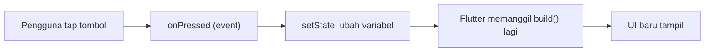
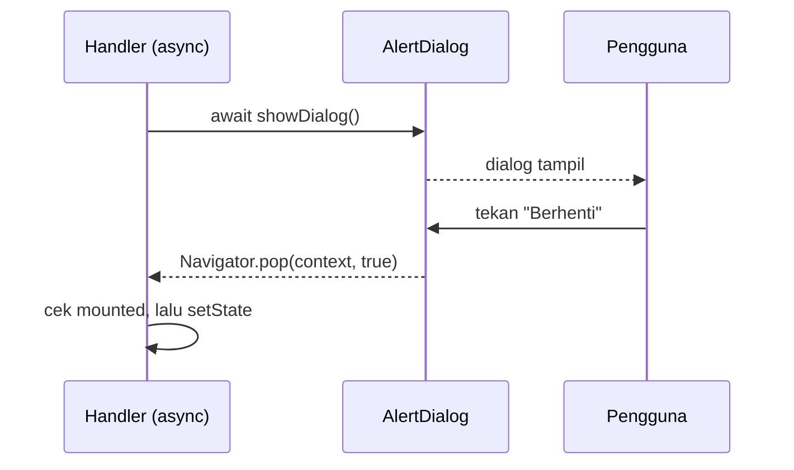
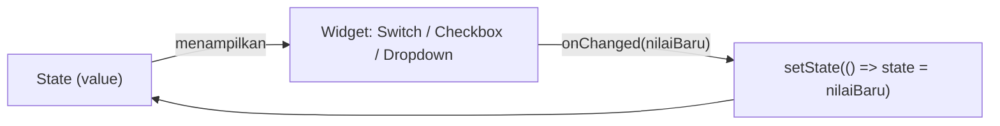
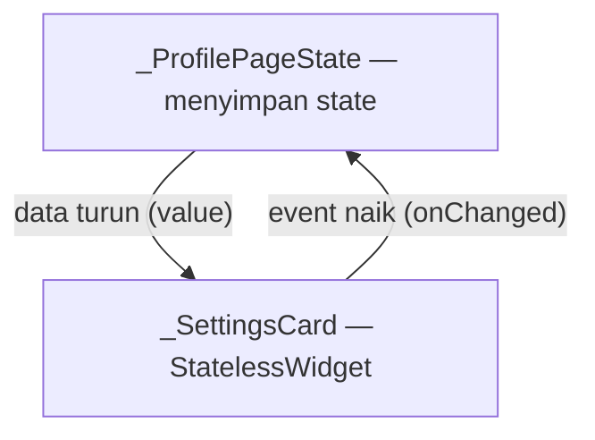

# Interaksi & State Dasar

Modul 7 · Workshop Mobile Application Framework

Event Handling · `setState()` · Dialog · Snackbar · Switch · Checkbox · Dropdown

<div class="abs-bl m-6 text-sm opacity-70">Fakhry Firdaus · Politeknik Negeri Jember</div>

<!--
Cara menjalankan: npx slidev slides-modul-07-interaksi-state-dasar.md
Tekan "o" untuk overview, "d" untuk dark mode, "p" untuk presenter mode.
-->

---

# 🎯 Tujuan Pembelajaran

Setelah modul ini, kamu mampu:

<v-clicks>

1. Menjelaskan **state** dan kenapa UI Flutter berubah saat state berubah
2. Menangani **event** pengguna (`onPressed`, `onTap`, `onChanged`)
3. Memakai `setState()` dengan benar dan menghindari kesalahan umum
4. Memberi umpan balik dengan **Snackbar** dan **Dialog**
5. Membuat input interaktif: **Switch**, **Checkbox**, **Dropdown**
6. Menerapkan pola industri: *state di satu tempat, data turun, event naik*

</v-clicks>

---
layout: two-cols
---

# 🏁 Hasil Akhir

Kartu Profil Digital milikmu akan punya:

<v-clicks>

- Tombol **Ikuti / Mengikuti** + jumlah pengikut yang berubah
- **Snackbar** dengan aksi *Undo*
- **Dialog** konfirmasi berhenti mengikuti
- Bio yang bisa dibuka-tutup
- Kartu **Pengaturan**: Switch, Checkbox, Dropdown
- Tombol **Reset** dengan konfirmasi

</v-clicks>

::right::

<div class="flex justify-center mt-4">
  <div class="w-64 rounded-3xl border-4 border-gray-400 p-3 text-xs bg-gray-500/10">
    <div class="font-bold text-sm mb-2">Kartu Profil Digital</div>
    <div class="text-center">
      <div class="mx-auto w-14 h-14 rounded-full bg-gray-500/40"></div>
      <div class="font-bold mt-1">Fakhry Firdaus</div>
      <div class="opacity-70">Mahasiswa</div>
      <div class="inline-block mt-1 px-2 py-0.5 rounded-full bg-green-500/30">💼 Open to Work</div>
    </div>
    <div class="flex justify-around my-2 p-2 rounded bg-gray-500/10 text-center">
      <div><b>48</b><br/>Postingan</div>
      <div><b>1201</b><br/>Pengikut</div>
      <div><b>320</b><br/>Mengikuti</div>
    </div>
    <div class="text-center p-1 rounded border border-gray-400">✓ Mengikuti</div>
    <div class="mt-2 p-2 rounded bg-gray-500/10">Tentang… <span class="text-blue-400">Selengkapnya</span></div>
    <div class="mt-2 p-2 rounded bg-gray-500/10">
      Keahlian: <span class="px-1 rounded bg-gray-500/30">Flutter</span> <span class="px-1 rounded bg-gray-500/30">Dart</span>
    </div>
    <div class="mt-2 p-2 rounded bg-gray-500/10">
      Open to Work ●<br/>☑ Flutter ☑ Dart ☐ Git<br/>Status: Mahasiswa ▼
    </div>
  </div>
</div>

---

# 🗓️ Rencana 2 × 4 Jam

<div class="grid grid-cols-2 gap-6 text-sm">
<div>

### Pertemuan 1

| Menit | Kegiatan |
|---|---|
| 15 | Persiapan & starter |
| 35 | Teori state & event |
| 40 | Lab 1: Tombol Ikuti |
| 15 | Istirahat |
| 25 | Lab 2: Pengikut |
| 30 | Lab 3: Snackbar |
| 25 | Lab 4: `onTap` bio |
| 40 | Challenge |
| 15 | Rangkuman |

</div>
<div>

### Pertemuan 2

| Menit | Kegiatan |
|---|---|
| 10 | Ulasan |
| 25 | Teori Dialog & controlled widget |
| 30 | Lab 5: Dialog |
| 20 | Lab 6: Switch |
| 15 | Istirahat |
| 25 | Lab 7: Checkbox |
| 25 | Lab 8: Dropdown |
| 35 | Lab 9: Refactor + Reset |
| 40 | Challenge |
| 15 | Rangkuman |

</div>
</div>

---
layout: section
---

# 📅 Pertemuan 1

Event · `setState()` · Snackbar

---

# Apa itu State?

**State** = data yang bisa berubah saat aplikasi berjalan dan memengaruhi tampilan.

<v-clicks>

- Sudah mengikuti atau belum?
- Berapa jumlah pengikut?
- Bio terbuka atau tertutup?

</v-clicks>

<v-click>

<div class="mt-8 text-center text-3xl font-bold">

UI = f(state)

</div>

<div class="text-center opacity-70 mt-2">State berubah → Flutter menggambar ulang UI dari state yang baru</div>

</v-click>

<!--
Tekankan: kita tidak menyuruh widget "ganti teks ini". Kita mendeskripsikan UI untuk setiap kondisi state.
-->

---

# Event & Callback

**Event** = kejadian dari pengguna. **Callback** = fungsi yang kamu titipkan untuk dijalankan *nanti*.

| Callback | Dipakai pada | Terpanggil saat |
|---|---|---|
| `onPressed` | Button, `IconButton` | Tombol ditekan |
| `onTap` | `InkWell`, `GestureDetector`, `ListTile` | Disentuh sekali |
| `onLongPress` | `InkWell`, `GestureDetector`, tombol | Ditekan lama |
| `onChanged` | `Switch`, `Checkbox`, `DropdownButton`, `TextField` | Nilai berubah |

---

# ⚠️ Kesalahan Klasik: Kurung `()`

<div class="grid grid-cols-2 gap-6">
<div>

### ❌ Salah

```dart
onPressed: _simpan(),
```

Fungsi **langsung dijalankan saat build**, bukan saat ditekan.

</div>
<div>

### ✅ Benar

```dart
onPressed: _simpan,
// atau
onPressed: () => _simpan(),
```

Fungsi dititipkan, dijalankan saat event terjadi.

</div>
</div>

---

# Alur `setState()`



<v-click>

<div class="mt-6 text-center text-lg">

`setState()` artinya: *"Data sudah berubah, tolong panggil ulang `build()`."*

</div>

</v-click>

---

# Aturan Emas `setState()`

<v-clicks>

1. **Variabel state di class State**, di luar `build()`. Variabel di dalam `build()` ter-reset setiap build.
2. Isi `setState(() { ... })` hanya **mengubah variabel**, dan harus **sinkron** (tanpa `async`).
3. Pekerjaan berat atau `await` dikerjakan **di luar** `setState`, lalu panggil `setState` setelah hasilnya ada.

</v-clicks>

---

# Dua Jenis State

| Jenis | Arti | Contoh | Alat |
|---|---|---|---|
| **Ephemeral (lokal)** | Dipakai satu layar/widget | Switch aktif, bio terbuka | `setState()` |
| **App state (global)** | Dipakai banyak layar | Data login, keranjang | Provider, Riverpod, Bloc |

<v-click>

<div class="mt-6 p-3 rounded bg-blue-500/10 border border-blue-500/30">

Hari ini fokus pada **ephemeral state**. Ini fondasi sebelum belajar state management.

</div>

</v-click>

---

# 🤔 Kuis Cepat

Apa yang tampil di layar setelah tombol ditekan 3 kali?

```dart {all|2|5-7|all}
class _CounterState extends State<Counter> {
  int _count = 0;

  void _onPressed() {
    _count++;
    debugPrint('count = $_count');
  }
  // build(): Text('$_count')
}
```

<v-click>

<div class="mt-2 p-3 rounded bg-red-500/10 border border-red-500/30">

Console: `1, 2, 3`. Layar: tetap **0**. Variabel berubah, tapi tidak ada `setState()`.

</div>

</v-click>

---
layout: section
---

# 🧪 Lab 1–4

Studi kasus: Kartu Profil Digital

---
zoom: 0.9
---

# Persiapan: Kode Awal (Starter)

Pakai kodemu sendiri atau kode starter dari modul. Struktur yang dipakai:

```dart {all|1-3|5-9|11-14}
class ProfilePage extends StatefulWidget {
  const ProfilePage({super.key});
  @override State<ProfilePage> createState() => _ProfilePageState();
}

class _ProfilePageState extends State<ProfilePage> {
  static const _name = 'Fakhry Firdaus';
  // ... _bio, build() dengan avatar, nama, statistik,
  //     tombol "Ikuti", dan kartu "Tentang"
}

// Widget kecil, StatelessWidget: hanya menampilkan data
class _StatItem extends StatelessWidget { /* label + value */ }
```

<div class="mt-4 p-3 rounded bg-green-500/10 border border-green-500/30">

✅ **Checkpoint:** `flutter run` menampilkan foto, nama, statistik, tombol *Ikuti*, dan kartu *Tentang*. Tombol belum berfungsi.

</div>

---

# Lab 1 — Tombol Ikuti (⏱ 40 menit)

**Target:** *Ikuti* berubah menjadi *Mengikuti* saat ditekan.

### Langkah 1–2: state dan tampilan

```dart {1|3-13}
bool _isFollowing = false; // di class State, di atas build()

_isFollowing
    ? OutlinedButton.icon(
        onPressed: _onFollowPressed,
        icon: const Icon(Icons.check),
        label: const Text('Mengikuti'),
      )
    : FilledButton.icon(
        onPressed: _onFollowPressed,
        icon: const Icon(Icons.person_add),
        label: const Text('Ikuti'),
      ),
```

---

# Lab 1 — 🧪 Eksperimen Tanpa `setState()`

```dart
void _onFollowPressed() {
  _isFollowing = !_isFollowing;
  debugPrint('isFollowing = $_isFollowing');
}
```

Hot reload, tekan tombol beberapa kali, lalu lihat **Debug Console**.

<v-click>

### Pertanyaan

Nilai di console berubah, tapi tombol tidak. **Kenapa?**

</v-click>

<v-click>

<div class="mt-2 p-3 rounded bg-yellow-500/10 border border-yellow-500/30">

Variabel memang berubah, tetapi Flutter tidak tahu harus menggambar ulang.

</div>

</v-click>

---

# Lab 1 — Perbaiki dengan `setState()`

```dart {2-4}
void _onFollowPressed() {
  setState(() {
    _isFollowing = !_isFollowing;
  });
}
```

<div class="mt-4 p-3 rounded bg-green-500/10 border border-green-500/30">

✅ **Checkpoint:** *Ikuti* ⇄ *Mengikuti* berganti dengan ikon yang sesuai.

</div>

<v-click>

<div class="mt-4 p-3 rounded bg-blue-500/10 border border-blue-500/30">

💡 **Insight industri:** tulis handler sebagai **method bernama** (`_onFollowPressed`), jangan menumpuk logika panjang di `onPressed: () { ... }`. Prefix `_on...` untuk handler, `_is...` untuk boolean.

</div>

</v-click>

---

# Lab 2 — Jumlah Pengikut (⏱ 25 menit)

```dart {1|3-9|11-13}
int _followers = 1200;

Card(
  child: Row(children: [
    const _StatItem(label: 'Postingan', value: '48'),
    _StatItem(label: 'Pengikut', value: '$_followers'),
    const _StatItem(label: 'Mengikuti', value: '320'),
  ]),
),

// ⚠️ Lepas `const` di Card & Row,
//    karena nilainya sekarang berubah.
```

<v-click>

<div class="mt-2 p-3 rounded bg-red-500/10 border border-red-500/30">

**Error `Not a constant expression`?** Nilai yang berubah tidak boleh ada di dalam `const`. Pertahankan `const` hanya pada bagian yang benar-benar tetap.

</div>

</v-click>

---

# Lab 2 — Method Eksplisit, Bukan Toggle

```dart {1-2|3|4-7|9-11}
/// Mengatur status ikuti ke nilai tertentu.
void _setFollowing(bool value) {
  if (_isFollowing == value) return; // tidak ada perubahan
  setState(() {
    _isFollowing = value;
    _followers += value ? 1 : -1;
  });
}

void _onFollowPressed() {
  _setFollowing(!_isFollowing);
}
```

<v-click>

<div class="mt-2 p-3 rounded bg-blue-500/10 border border-blue-500/30">

💡 **Idempoten:** dipanggil dua kali dengan nilai sama tidak mengubah apa-apa. Aman untuk tap berulang dan fitur **Undo**.

</div>

</v-click>

---

# Lab 3 — Snackbar (⏱ 30 menit)

Pesan singkat di bawah layar. Untuk **informasi tanpa memblokir** pengguna.

```dart {2|3|4-9}
void _showSnack(String message, {SnackBarAction? action}) {
  ScaffoldMessenger.of(context)
    ..hideCurrentSnackBar() // hindari menumpuk
    ..showSnackBar(
      SnackBar(
        content: Text(message),
        behavior: SnackBarBehavior.floating,
        action: action,
      ),
    );
}
```

---

# Lab 3 — Snackbar dengan Undo

```dart {1-2|3-8|9-11|13-17}
void _onFollowPressed() {
  if (_isFollowing) {
    _setFollowing(false);
    _showSnack('Kamu berhenti mengikuti $_name');
  } else {
    _setFollowing(true);
    _showSnack(
      'Kamu mulai mengikuti $_name',
      action: SnackBarAction(
        label: 'BATAL',
        onPressed: () => _setFollowing(false), // Undo
      ),
    );
  }
}
```

---

# Lab 3 — Checkpoint & Insight

<div class="p-3 rounded bg-green-500/10 border border-green-500/30">

✅ **Checkpoint**

- *Ikuti* → Snackbar muncul dengan tombol **BATAL**
- **BATAL** → status dan jumlah pengikut kembali
- Tekan cepat berulang kali → hanya **satu** Snackbar tampil

</div>

<v-clicks>

- Pakai `ScaffoldMessenger.of(context)`. Cara lama `Scaffold.of(context).showSnackBar` sudah ditinggalkan.
- Selalu `hideCurrentSnackBar()` sebelum menampilkan yang baru.
- **Undo** di Snackbar adalah pola UX standar untuk aksi ringan yang bisa dibatalkan.

</v-clicks>

---

# Lab 4 — `onTap` pada Bio (⏱ 25 menit)

```dart {1|3-5|9-13}
bool _isBioExpanded = false;

InkWell(
  borderRadius: BorderRadius.circular(12),
  onTap: () => setState(() => _isBioExpanded = !_isBioExpanded),
  child: Column(children: [
    Text('Tentang', style: textTheme.titleMedium),
    // ...
    Text(
      _bio,
      maxLines: _isBioExpanded ? null : 2,
      overflow: _isBioExpanded
          ? TextOverflow.visible
          : TextOverflow.ellipsis,
    ),
    Text(_isBioExpanded ? 'Tutup' : 'Selengkapnya'),
  ]),
),
```

---

# Lab 4 — ⚠️ Jebakan `maxLines` + `ellipsis`

<div class="p-3 rounded bg-red-500/10 border border-red-500/30">

`maxLines: null` + `overflow: TextOverflow.ellipsis` → Flutter hanya menampilkan **satu baris**, sisanya dibuang.

</div>

<v-click>

### Solusi

Buat `overflow` ikut state:

```dart
overflow: _isBioExpanded ? TextOverflow.visible : TextOverflow.ellipsis,
```

</v-click>

<v-click>

- Bio tertutup (2 baris) berakhir `...` → **normal**, penanda masih ada teks tersembunyi.
- `InkWell` memberi efek ripple. `GestureDetector` mendeteksi gestur yang sama tanpa efek visual.

</v-click>

---

# 🏆 Challenge Pertemuan 1 (⏱ 40 menit)

| Level | Tantangan |
|---|---|
| ⭐ | `IconButton` hati (♡) di samping nama: suka / batal suka (`favorite` merah ⇄ `favorite_border`) + Snackbar |
| ⭐⭐ | Tombol *Ikuti* memuat 1 detik: nonaktif (`onPressed: null`) + `CircularProgressIndicator`, lalu status berubah. *Petunjuk:* `_isLoading`, `await Future.delayed`, cek `mounted` |
| ⭐⭐ | **Easter egg:** tap avatar 5 kali berturut-turut → Snackbar rahasia, lalu counter reset |
| ⭐⭐⭐ | Pindahkan tombol ke widget sendiri `FollowButton` (StatelessWidget) dengan `isFollowing` dan `onPressed` |

---

# Rangkuman Pertemuan 1

<v-clicks>

- **State** = data yang berubah. **UI = f(state)**
- **Event** lewat **callback**: `onPressed: _fn`, bukan `_fn()`
- `setState()` memicu `build()` ulang. Tanpa itu, UI diam
- Variabel state ada di class State, **bukan** di `build()`
- **Snackbar** untuk pesan ringan, tambahkan **Undo**
- `_setFollowing(bool)` lebih aman daripada toggle

</v-clicks>

<v-click>

### 🎟️ Tiket keluar

1. Apa yang terjadi jika variabel diubah tanpa `setState()`?
2. Kenapa `const` harus dilepas saat menampilkan `$_followers`?
3. Apa beda `onPressed: _fn` dan `onPressed: _fn()`?

</v-click>

---
layout: section
---

# 📅 Pertemuan 2

Dialog · Switch · Checkbox · Dropdown

---

# Ulasan Pertemuan 1 (⏱ 10 menit)

Pastikan Kartu Profil Digital milikmu sudah punya:

- [x] Tombol Ikuti ⇄ Mengikuti
- [x] Jumlah pengikut berubah
- [x] Snackbar + Undo
- [x] Bio bisa dibuka-tutup

<div class="mt-6 p-3 rounded bg-yellow-500/10 border border-yellow-500/30">

Belum? Selesaikan dulu sebelum lanjut. Semua lab hari ini dibangun di atas kode ini.

</div>

---

# Dialog

Jendela kecil di atas layar yang **memblokir** interaksi sampai pengguna memilih. Untuk saat pengguna **harus memutuskan**.



---

# Snackbar vs Dialog

| | Snackbar | Dialog |
|---|---|---|
| Memblokir layar? | Tidak | **Ya** |
| Butuh keputusan? | Tidak (opsional Undo) | **Ya** |
| Contoh | "Berhasil disimpan" | "Hapus akun? Tidak bisa dibatalkan" |

<v-click>

<div class="mt-6 p-3 rounded bg-blue-500/10 border border-blue-500/30">

Terlalu banyak dialog membuat pengguna jengkel. Pakai dialog hanya untuk aksi **berisiko** atau yang **sulit dibatalkan**.

</div>

</v-click>

---
layout: section
---

# 🧪 Lab 5–9

---
zoom: 0.9
---

# Lab 5 — Helper Dialog Konfirmasi (⏱ 30 menit)

```dart {1-5|6-8|9-20|21}
Future<bool> _showConfirmDialog({
  required String title,
  required String message,
  required String confirmLabel,
}) async {
  final result = await showDialog<bool>(
    context: context,
    builder: (dialogContext) => AlertDialog(
      title: Text(title),
      content: Text(message),
      actions: [
        TextButton(
          onPressed: () => Navigator.pop(dialogContext, false),
          child: const Text('Batal'),
        ),
        FilledButton(
          onPressed: () => Navigator.pop(dialogContext, true),
          child: Text(confirmLabel),
        ),
      ],
    ),
  );
  return result ?? false; // null = ditutup dengan tap di luar
}
```

---
zoom: 0.9
---

# Lab 5 — Pakai di Handler (`async`)

```dart {1|2-10|12-17|19-20}
Future<void> _onFollowPressed() async {
  if (!_isFollowing) {
    _setFollowing(true);
    _showSnack('Kamu mulai mengikuti $_name',
        action: SnackBarAction(
          label: 'BATAL',
          onPressed: () => _setFollowing(false),
        ));
    return;
  }

  final confirmed = await _showConfirmDialog(
    title: 'Berhenti mengikuti?',
    message: 'Kamu tidak akan lagi melihat pembaruan dari $_name.',
    confirmLabel: 'Berhenti',
  );
  if (!confirmed || !mounted) return; // ⚠️ wajib cek setelah await

  _setFollowing(false);
  _showSnack('Kamu berhenti mengikuti $_name');
}
```

---

# Lab 5 — Checkpoint & Insight

<div class="p-3 rounded bg-green-500/10 border border-green-500/30">

✅ **Checkpoint**

- *Ikuti* → langsung berhasil + Snackbar (aksi ringan)
- *Mengikuti* → dialog muncul. **Batal** / tap di luar → tidak berubah. **Berhenti** → kembali ke *Ikuti*

</div>

<v-clicks>

- **Cek `mounted` setelah `await`** sebelum memakai `context` atau `setState`. Layar bisa saja sudah ditutup saat kamu menunggu.
- Beri nama berbeda (`dialogContext`) agar tidak tertukar dengan context halaman.
- Tutup dialog **dengan nilai** (`Navigator.pop(context, nilai)`), bukan mengubah state dari dalam dialog.

</v-clicks>

---

# Controlled Widget

Switch, Checkbox, Dropdown **tidak menyimpan nilainya sendiri**.



<v-clicks>

- Kamulah yang menyimpan nilai dan memanggil `setState()`
- Tanpa `setState()` di `onChanged`, widget **tidak berubah**
- `onChanged: null` → widget otomatis **nonaktif**

</v-clicks>

---

# Switch, Checkbox, Dropdown

| Widget | Tipe `value` | Untuk |
|---|---|---|
| `Switch` / `SwitchListTile` | `bool` | Aktif / nonaktif satu opsi |
| `Checkbox` / `CheckboxListTile` | `bool?` | Pilih **satu atau banyak** opsi |
| `DropdownButton` | tipe bebas | Pilih **satu** dari banyak opsi |

<v-click>

<div class="mt-6 p-3 rounded bg-blue-500/10 border border-blue-500/30">

Prinsip **single source of truth**: satu nilai, satu tempat.

</div>

</v-click>

---

# Lab 6 — Switch: Open to Work (⏱ 20 menit)

```dart {1|3-9|11-17}
bool _openToWork = false;

SwitchListTile(
  contentPadding: EdgeInsets.zero,
  title: const Text('Open to Work'),
  subtitle: const Text('Tampilkan lencana di kartu profilmu'),
  value: _openToWork,
  onChanged: (value) => setState(() => _openToWork = value),
),

// Di header profil: tampil hanya jika aktif
if (_openToWork) ...[
  const SizedBox(height: 8),
  const Center(
    child: Chip(label: Text('Open to Work')),
  ),
],
```

<div class="mt-2 p-3 rounded bg-green-500/10 border border-green-500/30">

✅ **Checkpoint:** geser Switch → lencana muncul / hilang.

</div>

---

# Lab 7 — Checkbox: Keahlian (⏱ 25 menit)

```dart {1-3|5-17}
static const _allSkills = ['Flutter', 'Dart', 'UI/UX', 'Firebase', 'Git'];
final Set<String> _skills = {'Flutter'};

for (final skill in _allSkills)
  CheckboxListTile(
    controlAffinity: ListTileControlAffinity.leading,
    title: Text(skill),
    value: _skills.contains(skill),
    onChanged: (value) {
      setState(() {
        if (value ?? false) {
          _skills.add(skill);
        } else {
          _skills.remove(skill);
        }
      });
    },
  ),
```

<v-clicks>

- `value` bertipe `bool?` → pakai `value ?? false`
- `Set` menjamin elemen **unik**, `contains()` sederhana

</v-clicks>

---

# Lab 7 — Tampilkan Chip Keahlian

```dart {1-2|3-11}
if (_skills.isEmpty)
  const Text('Belum ada keahlian dipilih')
else
  Wrap(
    spacing: 8,
    runSpacing: 8,
    children: [
      for (final s in _skills) Chip(label: Text(s)),
    ],
  ),
```

<div class="mt-4 p-3 rounded bg-green-500/10 border border-green-500/30">

✅ **Checkpoint:** centang / hapus centang → chip ikut bertambah / berkurang. Kosongkan semua → muncul teks kosong.

</div>

<div class="mt-2 p-3 rounded bg-yellow-500/10 border border-yellow-500/30">

⚠️ Menambah variabel state lalu aplikasi aneh? Lakukan **Hot Restart**. Hot reload mempertahankan state lama.

</div>

---

# Lab 8 — Dropdown dengan Enum (⏱ 25 menit)

```dart {1-8|10|12-22}
enum ProfileStatus {
  student('Mahasiswa'),
  freelancer('Freelancer'),
  intern('Magang'),
  employee('Karyawan');
  const ProfileStatus(this.label);
  final String label;
}

ProfileStatus _status = ProfileStatus.student;

DropdownButton<ProfileStatus>(
  isExpanded: true,
  value: _status,
  items: [
    for (final s in ProfileStatus.values)
      DropdownMenuItem(value: s, child: Text(s.label)),
  ],
  onChanged: (value) {
    if (value == null) return;
    setState(() => _status = value);
  },
),
```

---

# Lab 8 — Kenapa Enum? Jebakan Dropdown

<div class="grid grid-cols-2 gap-6">
<div>

### 💡 Enum > String mentah

- Typo `"Mahasiswa"` vs `"Mahasiwa"` mustahil
- Compiler memeriksa semua kasus
- `label` memisahkan nilai di kode dari teks untuk pengguna

</div>
<div>

### ⚠️ Error umum

```text
There should be exactly one item
with DropdownButton's value
```

`value` harus **tepat sama** dengan salah satu `value` di `items`, dan tidak boleh ada item kembar.

</div>
</div>

<div class="mt-4 p-3 rounded bg-green-500/10 border border-green-500/30">

✅ **Checkpoint:** pilih *Freelancer* → teks di bawah nama berubah (`Text(_status.label)`).

</div>

---

# Lab 9 — Refactor: Data Turun, Event Naik (⏱ 35 menit)

Kode `_ProfilePageState` sudah panjang. Pecah jadi widget yang rapi.



<v-clicks>

- `_SettingsCard` tidak tahu apa pun soal `setState()`
- Perilaku aplikasi **tidak boleh berubah**, hanya struktur kode
- Inilah dasar untuk memahami **state management**

</v-clicks>

---
zoom: 0.9
---

# Lab 9 — `_SettingsCard`: Kontrak Widget

```dart {1-2|3-10|12-18}
class _SettingsCard extends StatelessWidget {
  const _SettingsCard({
    required this.openToWork,
    required this.onOpenToWorkChanged,
    required this.allSkills,
    required this.selectedSkills,
    required this.onSkillChanged,
    required this.status,
    required this.onStatusChanged,
    required this.onReset,
  });

  final bool openToWork;                         // data turun
  final ValueChanged<bool> onOpenToWorkChanged;  // event naik
  final Set<String> selectedSkills;
  final void Function(String skill, bool selected) onSkillChanged;
  final ProfileStatus status;
  final ValueChanged<ProfileStatus> onStatusChanged;
  final VoidCallback onReset;
  // ... build(): Card berisi Switch, Checkbox, Dropdown, tombol Reset
}
```

---

# Lab 9 — Pakai di Halaman & Reset

```dart {1-10|12-26}
_SettingsCard(
  openToWork: _openToWork,
  onOpenToWorkChanged: (v) => setState(() => _openToWork = v),
  allSkills: _allSkills,
  selectedSkills: _skills,
  onSkillChanged: _onSkillChanged,
  status: _status,
  onStatusChanged: (v) => setState(() => _status = v),
  onReset: _onResetPressed,
),

Future<void> _onResetPressed() async {
  final confirmed = await _showConfirmDialog(
    title: 'Reset pengaturan?',
    message: 'Semua pengaturan akan kembali ke nilai awal.',
    confirmLabel: 'Reset',
  );
  if (!confirmed || !mounted) return;
  setState(() {
    _openToWork = false;
    _skills..clear()..add('Flutter');
    _status = ProfileStatus.student;
  });
  _showSnack('Pengaturan berhasil direset');
}
```

---

# Lab 9 — Checkpoint & Insight

<div class="p-3 rounded bg-green-500/10 border border-green-500/30">

✅ Semua fungsi **tetap sama** seperti sebelum refactor, ditambah **Reset** → dialog → Snackbar.

</div>

<v-clicks>

- **Refactoring yang benar = perilaku tidak berubah.** Uji ulang semua fitur.
- Buat **widget class**, bukan method `Widget _buildXxx()`. Flutter bisa mengoptimalkan widget class (terutama dengan `const`).
- `_SettingsCard` stateless dan mudah dites.
- Jaga `setState()` seluas yang dibutuhkan saja. Memecah widget menjaga rebuild tetap kecil.

</v-clicks>

---

# 💡 Praktik Terbaik Industri

<div class="text-sm">

| # | Praktik | Alasan |
|---|---|---|
| 1 | Variabel state di class State, bukan `build()` | `build()` dipanggil berulang, nilai ter-reset |
| 2 | `setState()` hanya ubah variabel, tanpa `async` | Update sinkron dan dapat diprediksi |
| 3 | Cek `mounted` setelah `await` | Mencegah error saat layar sudah ditutup |
| 4 | Handler berupa method bernama (`_onXxx`) | Terbaca, mudah di-debug dan dites |
| 5 | Method eksplisit > toggle | Idempoten, aman untuk Undo |
| 6 | `ScaffoldMessenger` + `hideCurrentSnackBar()` | Cara resmi, tidak menumpuk |

</div>

---

# 💡 Praktik Terbaik Industri (2)

<div class="text-sm">

| # | Praktik | Alasan |
|---|---|---|
| 7 | Snackbar untuk info ringan, Dialog untuk keputusan | UX tidak mengganggu |
| 8 | Enum untuk pilihan tetap | Aman dari typo |
| 9 | Widget class, bukan method `_buildXxx()` | Bisa `const`, rebuild efisien |
| 10 | **Data turun, event naik** | Dasar semua state management |
| 11 | `const` sebanyak mungkin pada bagian tetap | Mengurangi kerja rebuild |
| 12 | `onChanged: null` = widget nonaktif | Cara standar menonaktifkan input |

</div>

---

# Kapan `setState()` Tidak Cukup?

<v-clicks>

- Data dipakai di **banyak layar** (login, keranjang belanja)
- Logika sudah **rumit** dan sulit dilacak
- Industri memakai **Provider, Riverpod, atau Bloc**

</v-clicks>

<v-click>

<div class="mt-8 p-4 rounded bg-blue-500/10 border border-blue-500/30 text-center text-lg">

Konsepnya sama dengan hari ini:<br/>
**state di satu tempat, UI hanya membaca dan melaporkan event**

</div>

</v-click>

---

# 🛠️ Pemecahan Masalah Umum

<div class="text-sm">

| Gejala | Penyebab | Solusi |
|---|---|---|
| Tap tombol, UI tidak berubah | Lupa `setState()` | Bungkus perubahan dengan `setState` |
| Dialog / Snackbar muncul saat halaman dibuka | `onPressed: _fn()` | Tulis `onPressed: _fn` |
| `Not a constant expression` | `const` pada widget bernilai dinamis | Hapus `const` di bagian yang berubah |
| Nilai kembali ke awal tiap tap | Variabel state ada di `build()` | Pindah ke class State |
| Snackbar menumpuk | Tanpa `hideCurrentSnackBar()` | Pakai helper `_showSnack` |
| Error Dropdown `exactly one item` | `value` tidak ada di `items` / kembar | Pastikan `value` ada di `items`, unik |
| `use_build_context_synchronously` | Pakai `context` setelah `await` | Tambahkan `if (!mounted) return;` |
| Bio hanya 1 baris saat dibuka | `maxLines: null` + `ellipsis` | `overflow` ikut state |
| Perubahan aneh setelah tambah state | Hot reload pertahankan state lama | **Hot Restart** |

</div>

---

# 🏆 Challenge Pertemuan 2 (⏱ 40 menit)

<div class="text-sm">

| Level | Tantangan |
|---|---|
| ⭐ | Tambah keahlian baru (mis. `Docker`) dan opsi baru di `ProfileStatus` |
| ⭐ | `SwitchListTile` kedua "Tampilkan jumlah pengikut". Jika mati, angka diganti `—` |
| ⭐⭐ | Checkbox "Saya menyetujui syarat & ketentuan" + tombol **Bagikan Profil** yang **nonaktif** sampai dicentang. Saat ditekan: dialog ringkasan profil |
| ⭐⭐⭐ | **Undo Reset:** simpan kondisi sebelum reset, Snackbar dengan **BATAL** yang mengembalikannya |
| ⭐⭐⭐ | **Mode gelap:** `MyApp` jadi `StatefulWidget` menyimpan `ThemeMode`; Switch di `_SettingsCard`; perubahan naik lewat callback |
| 🌟 Bonus | Ganti `DropdownButton` dengan `DropdownMenu` (Material 3) dan bandingkan |

</div>

---

# ✅ Cek Pemahaman

<v-clicks>

1. Jelaskan alur dari *tap tombol* sampai *UI berubah* dengan kata-katamu sendiri
2. Kenapa Switch, Checkbox, dan Dropdown disebut *controlled widget*? Apa yang terjadi jika `onChanged` tidak memanggil `setState()`?
3. Kapan memilih Snackbar, kapan Dialog? Beri contoh di luar modul ini
4. Kenapa wajib cek `mounted` setelah `await`?
5. Apa arti "data turun, event naik"? Tunjukkan pada `_SettingsCard`
6. Kenapa `Set<String>` lebih cocok daripada `List<String>` untuk keahlian yang dipilih?

</v-clicks>

---
layout: center
class: text-center
---

# 🎉 Selamat!

Kartu Profil Digital milikmu sekarang sudah *hidup*:
merespons sentuhan, meminta konfirmasi, dan menyimpan pilihan pengguna.

<div class="mt-8 opacity-80">

**Modul berikutnya:** berpindah antarhalaman dan membawa data di antaranya

</div>

---

# 📚 Referensi

- [`setState` — API Flutter](https://api.flutter.dev/flutter/widgets/State/setState.html)
- [`AlertDialog` — API Flutter](https://api.flutter.dev/flutter/material/AlertDialog-class.html)
- [`SnackBar` — API Flutter](https://api.flutter.dev/flutter/material/SnackBar-class.html)
- [`SwitchListTile` — API Flutter](https://api.flutter.dev/flutter/material/SwitchListTile-class.html)
- [`CheckboxListTile` — API Flutter](https://api.flutter.dev/flutter/material/CheckboxListTile-class.html)
- [`DropdownButton` — API Flutter](https://api.flutter.dev/flutter/material/DropdownButton-class.html)
- [Ephemeral vs app state — docs.flutter.dev](https://docs.flutter.dev/data-and-backend/state-mgmt/ephemeral-vs-app)

<div class="mt-6 opacity-70 text-sm">

Kode lengkap ada di file modul: `modul-07-interaksi-state-dasar.md`

</div>
